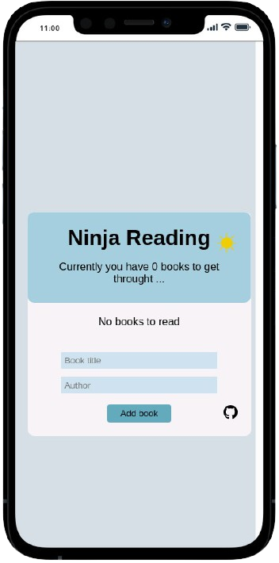

<h1 align="center">
  <br>
  <a href="https://nhope123.github.io/booklist/"></a>
  <br>
  Ninja Reading
  <br>
</h1>


<h4 align="center">Online book or blog reading tracker for all uncompleted reading.</h4>


<p align="center">
  <a href="#key-features">Key Features</a> •
  <a href="#how-to-use">How To Use</a> •
  <a href="#validation">Validation</a> •
  <a href="#credits">Credits</a> •
  <a href="#authors">Authors</a> •
  <a href="#license">License</a>
</p>

<div align='center' >
    
    
  
</div>

<h2 id='key-features' >Key Featuures</h2>

- Add book or blog information.
	+ Required input:
		* Title - The title of the book or blog.
		* Author - The name of the author.
		
- Removing existing entries.
- Toogle the theme between light and dark.

<h2 id='how-to-use' >How To Use</h2>

1. Run [online live](https://nhope123.github.io/booklist/) version.
2. Clone and run this application. You'll need [Git](https://git-scm.com) and [Node.js](https://nodejs.org/en/download/) (which comes with [npm](http://npmjs.com)) installed on your computer. From your command line:

```bash
# Clone this repository
$ git clone https://github.com/nhope123/booklist.git

# Go into the repository
$ cd booklist

# Install dependencies
$ npm install

# Run the app
$ npm start
```

Note: If you're using Linux Bash for Windows, [see this guide](https://www.howtogeek.com/261575/how-to-run-graphical-linux-desktop-applications-from-windows-10s-bash-shell/) or use `node` from the command prompt.

<h2 id='validation' >Validation</h2>

+ [mobile friendly test](https://search.google.com/test/mobile-friendly?id=SBoL0FuP4oxmw-ZJ-KYCvA)
+ [HTML Validation](https://validator.w3.org/nu/?doc=https%3A%2F%2Fnhope123.github.io%2Fbooklist%2F)

<h2 id='credits' >Credits</h2> 

This software uses the following open source packages:

- [React](https://reactjs.org/) - A JavaScript library for building user interfaces.
- [Node.js](https://nodejs.org/) - An asynchronous event-driven JavaScript runtime.
- [React Bootsrap icons](https://www.npmjs.com/package/react-bootstrap-icons) - Free svg icons personal use.
- [icon-icons](https://icon-icons.com/) - Free icons for personal and commercial use

<h2 id='authors' >Authors</h2>

+ [Nial Hope](https://github.com/nhope123) - Repository
  + [Portfolio](https://nhope123.github.io/)
  + [Linkedin](https://www.linkedin.com/in/nialhope/)

<h2 id='license' >License</h2>

Creole Food is an open source software licensed as [GNU General Public License v3.0](LICENSE).

